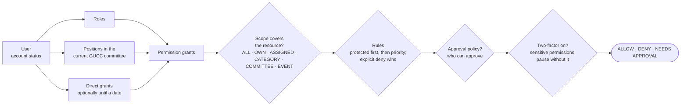

# GUCC platform architecture

```
Browser
  │  pages, server actions, /api/*                     uploads + images
  ▼                                                          │
Next.js frontend (Vercel, free)                              │
  │  lib/api/*: HTTPS + X-Api-Key (shared secret),           │
  │  forwards the visitor's session token, IP, user agent    │
  ▼                                                          ▼
API Worker (Cloudflare, free) ─── workers/api ─────────────────────────────
  │  /v1/public/*   published data (cached by Next under tags)
  │  /v1/rpc/:name  every other operation, via an allowlist of procedures
  │  /v1/upload     browser uploads with a 15-minute signed token
  │  /media/*       R2 objects: public cached for a year; private only with a signed, expiring link
  │  /v1/live       browser WebSocket to the live hub (Durable Object), with a 2-minute signed ticket
  │  cron           hourly housekeeping, reminders, email digest + free-tier guard; daily retention + clean-up
  │
  ├─ lib/server/services/*   business logic, authorization, validation, audit
  │     └─ lib/governance/*  pure permission / rule / approval engine
  ├─ D1 database  ("gucc" in production)
  └─ R2 buckets   gucc-media-public-<env>, gucc-media-private-<env>
```

The frontend never touches D1 or R2. It holds one server-only secret (`API_SHARED_SECRET`); browsers
never see it. The Worker authorizes every call against the signed-in user, so a compromised page can
at most do what that user may do.

## Request flow

- **Public pages** (`/`, `/executives/*`, `/events/*`, `/blog/*`, …) are static (ISR). Their data comes
  from `GET /v1/public/*` through `lib/public/data.ts`, cached in Next's data cache under tags
  (`committees`, `events`, `posts`, …). When an admin action changes data, the Worker reports the tags
  and the frontend refreshes them through `/api/revalidate`, so the next visitor sees the change. The
  hourly cron also pings `/api/revalidate` when it changes event statuses.
- **Admin pages** render per request. Each calls one "view" procedure (`lib/server/views/admin.ts`)
  that returns everything the page shows plus what the viewer may do there. Forms submit to server
  actions (`app/dashboard/actions.ts`), which call one procedure and then reload the page with a message.
- **Uploads** skip Vercel (4.5 MB body limit): a server action asks for a signed upload token, the
  browser resizes images to WebP variants and posts them to `/v1/upload`, and the Worker validates
  them and stores them in the bucket for their visibility.
- **Sessions:** `auth.login` returns a random token; Next stores it in an HttpOnly, Secure, SameSite=Lax
  cookie (`__Host-gucc_session` in production) and forwards it as a bearer token. The Worker stores
  only its SHA-256. A second, non-secret cookie (`gucc_signed_in`) tells static pages a session may
  exist, so anonymous visitors never call `/api/session`.

**Every mutation, in the Worker** (`workers/api/src/index.ts`), before and after the procedure runs:

1. edge guard: per-address in-memory limits on `/media`, `/health` and uploads, and method/URL checks,
   before any D1 or R2 work;
2. per-account ceiling on changes (300 per 10 minutes), so spreading requests over many addresses
   doesn't get around the per-address limits;
3. "confirm it's you" for access changes and deletions by holders of sensitive permissions (`STEP_UP`);
4. idempotency: a repeat within 10 seconds gets the first answer (`lib/server/idempotency.ts`);
5. the procedure: authorization through the engine, validation, a single batch (a transaction) with
   in-batch assertions for race-free transitions and optimistic locking (`lib/server/transition.ts`);
6. afterwards: email copies of the notifications that were really written (`email-outbox.ts`),
   unexpected errors to `error_events`, cache tags back to the website.

**Live updates.** Services record what changed with `emit()` (`lib/server/live.ts`); after the request
succeeds, `handleRpc` sends the list to the `LiveHub` Durable Object (`workers/api/src/live-hub.ts`), which
pushes each event to the WebSockets of the people it names. Tabs connect with a signed ticket from
`/api/live/ticket`; typing and active status use signed passes checked by the hub without D1. Pages keep
a slower timer as a fallback (`lib/api/live-client.ts`, `live-counts.ts`). The hub keeps each person's
last 20 seconds of events in memory: a page's first connection sends its age and gets what happened
while it was opening; later reconnects send "resync" so components fetch what they missed.

## Code layout

| Path                                            | Contents                                                                                                                                                                                                                                                                                                                    |
| ----------------------------------------------- | --------------------------------------------------------------------------------------------------------------------------------------------------------------------------------------------------------------------------------------------------------------------------------------------------------------------------- |
| `workers/api/src/`                              | Worker entry (`index.ts`), request context, procedure allowlist (`rpc.ts`), HTTP helpers                                                                                                                                                                                                                                    |
| `lib/server/services/`                          | One module per domain: auth, members, people, committees, executive-import, executive-bulk, governance, approvals, posts, events, media, recruitment, contact, community, assistant, maintenance                                                                                                                            |
| `lib/server/email.ts`, `lib/server/triggers.ts` | Outbound email behind one provider interface; notification rules (WHEN something happens THEN notify)                                                                                                                                                                                                                       |
| `lib/executive-import/`                         | Pure JSON/CSV parser for executive files (shared by the preview, the import and the tests)                                                                                                                                                                                                                                  |
| `lib/server/views/admin.ts`                     | One read model per admin page, including capability flags                                                                                                                                                                                                                                                                   |
| `lib/governance/`                               | Pure engine: scopes, rule evaluation, approval policies, protected invariants, default catalog                                                                                                                                                                                                                              |
| `lib/public/`                                   | Public read models (`read.ts`, used by the Worker), row→page builders (`shapes.ts`), frontend fetchers (`data.ts`)                                                                                                                                                                                                          |
| `lib/api/`                                      | Frontend side of the API: client, session helpers, route-handler forwarding, config                                                                                                                                                                                                                                         |
| `lib/media/`                                    | Byte-level file checks and metadata stripping (Worker), browser image pipeline and upload client                                                                                                                                                                                                                            |
| `app/dashboard/`                                | The dashboard for everyone (members, executives, leaders); `app/auth` for sign-in                                                                                                                                                                                                                                           |
| `migrations/`                                   | `0001` schema, `0002` default governance, `0003` hardening (indexes, split buckets, recruitment, inbox), `0004` governance v2, `0005` platform v3 (event Google Forms, contest↔event, recruitment reviewers and notes, member review notes), `0006` governance v3 (2026 positions split out, import and reset permissions) |
| `scripts/platform/`                             | Migration, verification, media migration, bootstrap, cleanup and production setup                                                                                                                                                                                                                                           |

## Data model

The main groups (see `migrations/0001_core_schema.sql` and `0003_hardening.sql`):

- **Identity:** `users` (login and lifecycle status), `profiles` (the person: name, student ID, photo,
  links), `sessions`, `auth_tokens` (verification, reset, invitations), `authentication_events`,
  `rate_limits`. A profile can exist without an account; every legacy executive is one.
- **Authorization:** `roles`, `permissions`, `role_permissions`, `user_roles`, `positions`, `position_permissions`.
- **Organisation:** `committees` (one per term; exactly one `CURRENT`; `layout_json` holds campus and
  wing tabs such as 2026's GUCC and CSS) and `committee_members` (person × position × term).
- **Governance:** `rules`, `rule_conditions`, `rule_actions`, `approval_policies`, `approval_requests`, `approval_steps`.
- **Content:** `posts`, `post_revisions`, `categories`, `tags`, `post_tags`; `events`, `event_people`,
  `event_registrations`, `event_media`; `contests`, `contest_teams`, `contest_media`; `external_forms`.
- **Recruitment and inbox:** `recruitment_campaigns`, `recruitment_applications` (private), `contact_messages`.
- **Platform:** `media` (with `bucket` public/private), `media_references`, `notifications`,
  `audit_logs` (append-only, enforced by triggers), `organization_settings`, `system_settings`.

## Governance



Every decision goes through this chain (`lib/governance/engine.ts`); no service compares role or
position names (`tests/unit/authorization-guard.test.ts` fails if one does). Renaming a position or
moving a permission in the dashboard changes who can do what without a code change. The **Access
simulator** (Governance → Access simulator) runs the chain for any person, action and real item and
shows each step.

- **Authentication is separate from authorization.** Signing up gives no privileges: accounts verify
  their email, wait in `PENDING_APPROVAL`, and become `ACTIVE` members when a leader with
  `members.approve` approves them. Positions and roles are assigned separately.
- **Roles** are system concepts: Moderator (protected, at most 3), Technical Administrator (media,
  forms, settings; does not approve members by default), Developer (no permissions until granted),
  Executive (automatic for current position holders), Member.
- **Positions** are organisational and seeded from the 2026 structure (President, VP Activity, VP
  Technical, General Secretary, Joint General Secretary, Treasurer, … Executive Member). Their default grants are data, editable at
  `/dashboard/positions`; new positions are created there without code changes.
- **Scopes:** `ALL`, `OWN`, `ASSIGNED`, `COMMITTEE`, `POSITION`, `CATEGORY:<slugs>`, `EVENT:ASSIGNED`.
- **Rules:** WHEN conditions THEN allow, deny or require approval, WITH a scope; evaluated
  deterministically (protected first, then priority; an explicit deny wins). Moderators, the President
  and the General Secretary create operational rules at `/dashboard/rules`.
- **Approval policies:** President or General Secretary, President and General Secretary, any Moderator, 2 of 3 Moderators, a
  specific position, assigned people, or custom; edited with a structured editor at `/dashboard/settings`.
- **Notification rules** (`lib/server/triggers.ts`): WHEN an event happens (an event or post is
  submitted or published, a membership application, recruitment application or contact message
  arrives) and optional conditions hold, THEN notify holders of chosen positions, roles or permissions
  in the app. They never grant or remove access; authorization reads only access rules.
- **Invariants in code** (`lib/governance/invariants.ts`): nobody changes their own role or position;
  only Moderators grant the Moderator role; at most three; the last one can't be removed; you can only
  grant permissions you hold club-wide; protected rules, settings, roles and permission assignment
  need Moderator authority, and a second Moderator's approval when one exists.

Default hierarchy (all editable): Moderators have everything. Since 2026-09-29 the President and the
General Secretary have exactly the Moderators' authority while they hold the position in a governing
unit of the current committee (`MODERATOR_EQUAL_POSITIONS` in `lib/governance/engine.ts`): every
permission, protected governance, approving what "a Moderator" approves, and appointing Moderators
(a protected change another of them confirms). Nobody changes their own access. VPs, secretaries and coordinators get category- or
assignment-scoped rights (for example, the Sports Secretary manages sports events, the Photography
Secretary uploads to events they're assigned to, and the Publication Secretary's posts need President
or General Secretary approval). Executive Members draft their own posts and submit them for approval.

## Executives

- `/executives` lists the current committee first, then the archive; `/executives/<year>` shows faculty
  and students with campus or wing tabs; `/executives/<studentId>` is a profile with every role held.
- Admins add executives from the committee page: pick an existing person or create one (name, student
  ID or faculty designation, photo), choose the position with a live preview of its permissions, choose
  the campus or wing, and optionally invite them by email. Accepting the invitation sets a password and
  activates the account; the position's permissions apply immediately.
- "Start the next committee" creates the next term as Upcoming with the same campus/wing layout.
  "Make current" archives the previous term; history is never rewritten.
- **Bulk tools** (`executives.import`): import many executives from JSON or CSV with a full preview
  (see [EXECUTIVE_IMPORT.md](EXECUTIVE_IMPORT.md)), and change many listings at once on a committee
  page (end, reactivate, change position, copy to another committee, sort by rank). Both preview first,
  apply in one transaction and audit every listing.

## Accounts and email

- **Mode A, email available** (an SMTP2GO key, or development): sign up → verify email → wait for
  approval → active. Verification, reset and invitation links are emailed.
- **Mode B, no provider** (staging or production without one): sign up → wait for approval → active,
  with the message "Your account has been created and is awaiting GUCC approval." Reviewers are
  notified in the app and confirm who the applicant is. Password resets are one-time links issued by an
  administrator (`users.reset_password`), and invitations hand the link to the inviting administrator.
  No screen ever claims an email was sent when it wasn't.
- Reset links work once, expire (24 hours; an hour for emailed ones), and only their hash is stored.
  An administrator can't issue one for their own account, for a Moderator (unless they are one) or
  for anyone holding club-wide permissions they lack. Changing your password signs out your other
  sessions.
- Registering with a student ID that belongs to an existing profile (for example a former executive)
  records a claim; nothing is linked until a reviewer approves it. **Approve and link** attaches the
  account, and the position's permissions apply. The very first administrator (e.g. the current General Secretary) is
  linked with `scripts/platform/bootstrap-admin.ts`.

## Security controls

| Area            | Control                                                                                                                                                                                                                            |
| --------------- | ---------------------------------------------------------------------------------------------------------------------------------------------------------------------------------------------------------------------------------- |
| Frontend ↔ API | Shared secret (constant-time compare) on every `/v1` call; procedure allowlist; client IP forwarded only by the trusted frontend; `API_VERSION` contract with safe defaults when versions differ mid-deploy                        |
| Floods          | Vercel DDoS protection, Attack Challenge Mode and Firewall rules (RUNBOOK.md); the Worker's in-memory per-address limits; D1 rate limits with an in-memory "blocked until"; per-account ceiling on changes; Turnstile              |
| Concurrency     | Idempotency keys; race-free transitions (guarded update + in-batch assertion); optimistic locking on edit forms; atomic usage budgets                                                                                              |
| Passwords       | PBKDF2-SHA256 over HMAC(`PASSWORD_PEPPER`, password), 20 000 iterations, per-user salt; fits the free plan's 10 ms CPU limit, and a leaked database alone can't be brute-forced                                                    |
| Sessions        | 256-bit token, `__Host-` HttpOnly/Secure/SameSite=Lax cookie, stored hashed; revoked on logout, suspension and password reset; idle and absolute timeouts; expired rows purged hourly                                              |
| Secrets         | Rotation with overlap: `API_SHARED_SECRET_NEXT`, `AUTH_SECRET_PREVIOUS` (tokens and links keep working; two-factor secrets re-encrypted on use), `PASSWORD_PEPPER_PREVIOUS` (hashes name their pepper and are upgraded at sign-in) |
| Brute force     | Per-IP and per-account rate limits; lockout after 5 failures; Turnstile on sign-up, login, reset, contact, recruitment and anonymous registration                                                                                  |
| CSRF            | Server actions (Next's origin check); route handlers reject cross-site writes; uploads accept only the frontend origin (CORS) plus a signed token                                                                                  |
| SQL / XSS       | Prepared statements everywhere; React escaping; Markdown rendered with raw HTML escaped                                                                                                                                            |
| Files           | Type from bytes, size and dimension limits, EXIF/GPS stripped, random keys; private files in a separate bucket, served only with HMAC-signed links that expire                                                                     |
| Privacy         | Phone numbers, grades and ID documents never reach public read models; recruitment views and exports are audited                                                                                                                   |
| Audit           | Append-only; actor, action, resource, reason, request ID, before/after, authorization decision; sign-in activity (including failures) in `/dashboard/audit`                                                                        |
| Headers         | CSP, HSTS, COOP, nosniff, referrer and permissions policies; admin, account and auth pages unframeable and uncacheable; media served with `CSP: sandbox` and `nosniff`                                                             |

## Free-tier fit

Only R2 bills past its free amount; the guards are in RUNBOOK.md, "Staying on the free plans":
atomic daily write caps, a storage cap at 8 GB of the free 10 GB, an automatic upload pause at 90% of
free storage or writes, warnings at 70%, and setting ranges that can't be raised past the free
amounts. System health shows usage against every free limit.

| Limit                                     | Status                                                                                                                                                                                                                                                                                  |
| ----------------------------------------- | --------------------------------------------------------------------------------------------------------------------------------------------------------------------------------------------------------------------------------------------------------------------------------------- |
| Worker size, 3 MiB gzip                   | About 80 KiB gzip; CI fails above 3 MiB                                                                                                                                                                                                                                                 |
| D1, 50 statements per invocation          | Every request stays at or under 45 (a test enforces it): lists of rows are written with one set-based statement (`json_each`), not one per row. The Worker logs a warning above 40.                                                                                                     |
| Worker CPU, 10 ms per request             | Password hashing ~3 ms (a pepper rotation adds no second hash: hashes name their pepper); images are resized in the browser; audit seals cover at most 300 rows; System health recomputes only the newest seal                                                                          |
| Workers, 100k requests/day                | Public pages are static; admin pages make one or two calls; no background prefetching in the admin                                                                                                                                                                                      |
| D1, 5 GB / 5M reads a day                 | Small dataset; indexed queries                                                                                                                                                                                                                                                          |
| R2, 10 GB / 1M writes / 10M reads a month | About 46 MB now. Photos keep only the sizes their purpose needs (avatars 400/800 px, lost & found up to 1280, events and library up to 1920), about half the storage per photo; caps and the automatic pause above                                                                      |
| Vercel Hobby                              | Static and ISR pages (news, announcements, forms, certificates and lost & found are cached); anonymous visitors don't call `/api/session`; OG cards render only for URLs the site signed; images come from the Worker, not Vercel's image optimizer; functions run in `sin1` next to D1 |
