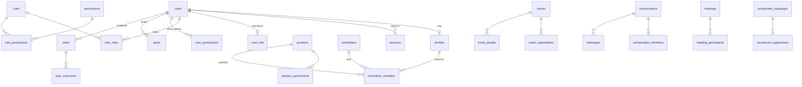

# The GUCC database (Cloudflare D1)

One SQLite database on Cloudflare D1, used only by the API Worker. The website never touches it
directly. Schema changes live in `migrations/` and are applied in order by
`wrangler d1 migrations apply` (the release script does this after taking a backup).

| File                       | What it adds                                                                                                                                                                                                                                                                                           |
| -------------------------- | ------------------------------------------------------------------------------------------------------------------------------------------------------------------------------------------------------------------------------------------------------------------------------------------------------ |
| `0001_core_schema.sql`     | accounts, profiles, governance (roles, permissions, positions, rules, approvals), content, events, media, notifications, audit log, settings                                                                                                                                                           |
| `0002_governance_seed.sql` | the permission catalog, roles, positions and rules (generated)                                                                                                                                                                                                                                         |
| `0003_hardening.sql`       | extra indexes, invitation links to profiles, recruitment uniqueness                                                                                                                                                                                                                                    |
| `0004`, `0006`, `0008`     | later catalog versions (generated by `scripts/platform/render-seed.ts`; never edit by hand)                                                                                                                                                                                                            |
| `0005_platform_v3.sql`     | recruitment, contact inbox, committee units (campuses and wings)                                                                                                                                                                                                                                       |
| `0007_platform_v4.sql`     | direct grants, governance levels, two-factor, audit seals, messaging, reports, lost & found moderation, page content settings, tasks, meetings, heartbeats; usage counters, idempotency keys, error events, email log, email choices, race-free transitions, media lifecycle, two-year audit retention |

Every migration is additive: new tables, and new columns that are nullable or have a default.
No migration deletes data. Releases enforce this: `scripts/platform/lib/migration-lint.ts` refuses a
pending migration that drops or renames a table or column, rebuilds a table, or runs `DELETE`/`UPDATE`
without `WHERE` (a reviewed exception carries `-- safety: reviewed <reason>`). That is what makes the
automatic Worker rollback safe: the previous Worker still runs on the migrated database.

## Tables by area

**People and sign-in**

- `users`: sign-in accounts (email, password hash, status, message privacy, read receipts, whether they share their active status, `last_active_at`).
- `profiles`: the person behind listings, members and authors. It may have no account (older
  executives). `merged_into_id` points to the kept profile after a duplicate is merged.
- `sessions`: signed-in devices. Only a SHA-256 of the cookie is stored. `mfa_pending` marks a
  sign-in still waiting for its two-factor code; `reauth_at` is the last password or code
  confirmation, used for sensitive actions.
- `user_mfa`: the authenticator secret (AES-GCM encrypted with a key derived from `AUTH_SECRET`),
  hashed recovery codes, and the last accepted code step (replay protection).
- `auth_tokens`: one-time links (email verification, password reset, invitation).
- `authentication_events`, `rate_limits`.

**Governance**

- `roles`, `permissions`, `role_permissions`, `user_roles`.
- `positions` (with `governance_level`: Moderator 100, President 90, General Secretary 80, Vice
  Presidents 70, Secretaries 60, Coordinators 50, Executive Members 20) and `position_permissions`.
- `user_permissions`: a permission given directly to one person, optionally until a date.
- `rules`, `rule_conditions`, `rule_actions`: exceptions evaluated by the engine
  (`lib/governance/engine.ts`).
- `approval_policies`, `approval_requests`, `approval_steps`.
- `committees`, `committee_members`: executive listings per term. Only listings in GUCC's own unit
  (`governance.governing_units`) carry position authority; affiliated committees such as CSS don't.

**Content, events and media**: `posts` (+ `post_revisions`, `post_tags`, `post_media`),
`categories`, `tags`, `events` (+ `event_agenda_items`, `event_people`, `event_registrations` with
check-in time, `event_media`), `post_reactions`, `posts.pending_revision_id` (an edit of a live post
waiting for approval), `contests` (+ teams and media), `media` (+ `media_references`), `external_forms`,
`certificate_programs`, `certificate_recipients`.

**Members' tools**

- `conversations` (one per pair of people, `pair_key` unique; a group is a conversation with a
  `chat_groups` row and `pair_key = 'group:<id>'`), `conversation_members` (role OWNER/MEMBER,
  joined and left times), `messages` (TEXT or SYSTEM lines, replies), `message_reactions` (one per
  person per message), `user_blocks`, `reports` (reported messages and lost & found posts).
- `tasks` (for an account, or for an email address until that person has an approved account; labels,
  board order, comment count, the meeting that created it), `task_items` (checklist),
  `task_comments`, `task_templates`.
- `meetings` (a Google Meet link in `meet_url` or any https link in `join_url`; decisions; weekly
  series), `meeting_participants` (reply, attendance) and `meeting_agenda_items`.
- `lost_found_posts` (+ legacy `lost_found_messages`, moved into conversations by 0007).
- `recruitment_campaigns`, `recruitment_applications`, `recruitment_notes`, `contact_messages` (`topic`, from 0012: general, membership, events, partnership or website; null for older messages).
- `notifications`: in-app notices; `email_state` DUE / SENT / SKIPPED drives the hourly email digest.

**Records and settings**

- `audit_logs`: append-only (triggers refuse updates, and deletes of anything younger than two
  years). `audit_seals` chains an hourly SHA-256 over new rows (at most 300 per seal, to stay inside
  the Worker's CPU limit); `scripts/platform/verify-audit.ts` recomputes the whole chain.
- `usage_counters`: atomic daily budgets (`day`, `key`, `count`): R2 files written, applicant
  files, AI answers, emails; `day = 'total'` holds the running total of stored bytes.
- `idempotency_keys`: a repeated action within 10 seconds gets the first answer.
- `error_events` (unexpected errors, for System health), `email_log` (every email and SMTP2GO's
  answer), `notification_preferences` (each person's email choices).
- `batch_assertions`: never holds a row; inserting into it aborts the batch. Used to make
  multi-step changes race-free (below).
- `organization_settings` (public page content: `page.home`, `nav.services`,
  `page.collaborations`, `lostfound.config`, `site.contributors`, …) and `system_settings`
  (governance and security switches).
- `system_heartbeats`: when the hourly housekeeping last ran.
- `migration_runs`, `migration_source_map`, `migration_conflicts`: the one-time import from the
  old JSON files.

### Round 9 (`0017_round9.sql`)

| Table                                                                         | What it holds                                                                                                         |
| ----------------------------------------------------------------------------- | --------------------------------------------------------------------------------------------------------------------- |
| `external_forms` (+ columns)                                                  | A form's provider, embed and open addresses, sign-in, schedule, listing, cover, event, responses sheet (leaders only) |
| `external_form_slugs`                                                         | Every address a form has had (`COLLATE NOCASE`), so old links keep working                                            |
| `email_campaigns`, `email_campaign_recipients`                                | Announcement and certificate emails and each person's state (claimed with `UPDATE … RETURNING`, unique per address)   |
| `email_suppressions`                                                          | Guests who unsubscribed (a hash of the address)                                                                       |
| `certificate_designs`                                                         | Saved designs: a template plus wording, signatories, logos, colours                                                   |
| `certificate_batches`                                                         | One issue, with its design frozen (`design_snapshot_json`)                                                            |
| `certificates`                                                                | One per person per issue: an unguessable 16-character code, the printed name, status, visibility                      |
| `messages.mentions_json`, `profiles.email_display`, `posts.email_intent_json` | Mentions, which email listings show, "email it when it's published"                                                   |

## Relationships (main ones)

## Rules the schema enforces

- Foreign keys everywhere (D1 enforces them).
- CHECK constraints on every status or kind column, JSON validity on JSON columns, a task needs
  an account or an email, a meeting link must be `https://meet.google.com/…`.
- Uniqueness where the club's rules need it: one live direct grant per person, permission and
  scope; one conversation per pair; one block per pair; one report per person per item; one
  application per student ID and per email in a recruitment; one current committee.
- Soft delete (`deleted_at`) for anything people might want back: executive listings removed as
  mistakes can be restored from the committee page for 30 days.
- **Race-free state changes.** Approving or rejecting a member, suspending, deciding an approval
  request, publishing a post or event: the guarded `UPDATE` stamps the row's `last_transition` with
  the request's token, and the next statement asserts the stamp. D1 runs batches one at a time, so
  of two leaders acting at once, the second batch fails its assertion and is rolled back whole: one
  audit entry, one notification, one email (`lib/server/transition.ts`). The same assertion keeps a
  position within `max_holders` and one recruitment open at a time, inside the transaction.
- **Optimistic locking.** Edit forms send the `updated_at` they loaded; a save over someone else's
  newer change is refused with who changed it and when.

**Constraints audit (2026-09-27).** Every table was checked for natural keys, enum CHECKs and
foreign keys. The schema already had them (the status and scope columns of the older tables have
CHECKs); no new unique index was needed, so no migration can fail on existing duplicates. The rules
SQL constraints can't express (at most N holders, one open recruitment, "only if still pending")
are the in-batch assertions above.

## Staying inside the free plan

A Worker request on the free plan may run at most 50 D1 statements. Every request path is
written to stay under 45 however much data it touches: many-row changes are one statement over
`json_each(?)` (for example inviting a whole committee to a meeting, or importing 500
applications). `tests/integration/query-budget.test.ts` measures the heaviest paths against
large data and fails if any goes over 45.

## Housekeeping

**Hourly** (`lib/server/services/maintenance.ts`, cron `17 * * * *`):

- expired sessions, used or expired one-time links, and old rate-limit rows are deleted;
- event status follows the clock (published → ongoing → completed);
- expired direct grants are closed;
- read notifications older than `notifications.retention_days` (180) are deleted;
- lost & found posts are archived (resolved after 30 days, unresolved after 90, from
  `lostfound.config`), with a notice to the owner a week before;
- abandoned upload files are removed and the stored-bytes total is recounted;
- the free-tier guard warns Moderators at 70% of a free limit and pauses uploads at 90% of R2's;
- new audit rows are sealed; the run is recorded in `system_heartbeats`.

**Daily** (`lib/server/services/retention.ts`, cron `43 21 * * *`, its own invocation and statement
budget): data retention as listed in [PRIVACY.md](PRIVACY.md), and the media lifecycle: files
nothing uses get `unreferenced_since`; a Moderator can delete them permanently after 30 days
(Media → _Unused 30+ days_). A file used anywhere (including inside a post body, an event
description or page content) is never marked, archived or deleted.

## Checks

- `bun run test` includes `tests/integration/schema-integrity.test.ts`: every migration applied
  to a fresh database, then `PRAGMA integrity_check`, `PRAGMA foreign_key_check`, foreign-key
  indexes on the v4 tables, and the uniqueness rules above.
- CI also applies the migrations to a local D1, imports the old JSON data and runs
  `scripts/platform/verify.ts --strict`.
- The dashboard's **System health** page queries the database and the migration list live, and
  each production release ends with a read-only `PRAGMA quick_check` and `PRAGMA foreign_key_check`
  (D1 doesn't allow the slower `integrity_check`).

## Backups and restore

- Every production release exports the database first and checks the file (not empty, has the
  tables) before anything changes (`scripts/platform/release.ts`). In GitHub Actions the file is
  encrypted with `BACKUP_PASSPHRASE` before it's kept as an artifact (30 days); without the
  passphrase it isn't kept at all. A weekly workflow (`backup.yml`) does the same, keeps the copy
  for 90 days, and **restore-tests** it: decrypts it again, loads it into a throwaway SQLite
  database on the runner, runs `integrity_check` and `foreign_key_check`, and compares row counts
  with production (`scripts/platform/restore-check.ts`).
- D1 Time Travel can also restore the database to any minute in the last 30 days (free plan: 7
  days): `bunx wrangler d1 time-travel restore gucc --env production --timestamp <ISO time>`.

**Restore from a backup file**

1. Download the artifact and decrypt it:
   `openssl enc -d -aes-256-cbc -pbkdf2 -iter 600000 -in backup.sql.enc -out backup.sql`
2. Check it: `bun scripts/platform/restore-check.ts backup.sql` (loads it into memory and runs
   the checks), or try it on a local database: `bunx wrangler d1 execute DB --local --file backup.sql`
3. For production, prefer Time Travel. If you must load the file, create a new D1 database, load
   the file into it, check it with the dashboard's System health, then point the Worker's
   `database_id` at it and release.

### Round 8 additions (0012, 0013)

- `contact_messages.topic`: what a contact message is about (general, membership, events, partnership, website).
- `profiles.cutout_media_id`: the member's profile photo with its background removed (transparent), shown on the executives list; cleared when the photo changes without one.
- Partial indexes on every column that points at a file (`profiles.avatar_media_id`, `committee_members.avatar_media_id`, `events.banner_media_id`, `event_media.media_id`, `posts.featured_media_id`, `contest_media.media_id`, `lost_found_posts.image_media_id`, `chat_groups.photo_media_id`, the three recruitment files), so "is this file used?" is a search per place.

### 0014, 0015, 0016

- `conversation_members.is_admin` (0014): a group member made an admin; the owner stays `role = 'OWNER'`.
- `users.security_emails` (0015): the member chose security alerts by email. Every notification email is off by default; the other choices are rows in `notification_preferences`.
- `cache_stamps` (0015): a change counter per cached thing; triggers on `rules`, `rule_actions`, `rule_conditions` and `approval_policies` bump `rules`, so each Worker reads the rules again only after a change.
- `posts_author_profile_idx` (0015): a person's posts by their profile (member pages, profile saves).
- `sponsorship_pages` (0016): one row per sponsorship opportunity (`slug`, `title`, `summary`, `status` ACTIVE/INACTIVE, `is_default`, `sort_order`, `content_json` in the CSE Carnival page's shape). At most one default (unique partial index), and the default is always ACTIVE (CHECK). The Carnival page is copied in from the `page.sponsorship` setting. `0016` also adds the general page `partner-with-gucc` (active, not the default; from `lib/sponsorship/general.ts`, with the Carnival page's achievements, partners and contacts). `sort_order` is the order on `/become-a-sponsor` after the default; `sponsorships.move` renumbers it.
